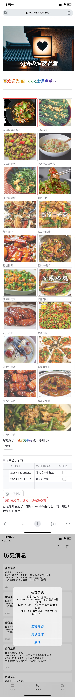

# 深夜食堂点单系统（LOVEMENU）

这是一个使用 Streamlit 构建的深夜食堂点单系统，用户可以通过图片选择菜品，添加到点单列表，并通知后厨准备。系统还支持菜品的删除操作，并且会将点单信息通过 Bark 通知推送给后厨。



## 功能特点

- **图片化点单**：用户可以通过浏览图片选择菜品，直观方便。
- **实时更新**：点单列表实时更新，用户可以随时查看已点菜品。
- **菜品删除**：支持删除已点菜品，方便用户修改点单。
- **Bark 通知**：点单完成后，系统会将点单信息通过 Bark 通知推送给后厨。

## 安装步骤

### 克隆仓库

```bash
git clone https://github.com/SonnyGong/LoveMenu.git
cd LOVEMENU
```

### 安装依赖

```bash
pip install -r requirements.txt
```

## 使用说明

### 替换菜单

如果要替换菜单，只需要替换 `pic` 文件夹中的图片即可。系统会自动识别 `pic` 文件夹中的图片，并将其显示在点单界面。

### 配置 Bark 通知

系统使用 Bark 通知将点单信息推送给后厨。你需要在 `func.py` 文件中替换 `BarkNotificator` 的 `device_token` 为你自己的 Bark token。具体配置方法可以参考 [Bark 官方文档](https://github.com/Finb/Bark)。

### 运行系统

```bash
streamlit run main.py
```

### 点单流程

1. 打开系统后，你会看到一个带有餐厅名称的图片标题。
2. 浏览图片选择菜品，点击图片后会显示确认添加按钮。
3. 点击 “添加” 按钮将菜品添加到点单列表。
4. 在点单列表中，你可以勾选要删除的菜品，然后点击 “🗑️ 执行删除” 按钮删除菜品。
5. 当你确认点单完成后，点击 “就这么多了，通知 [你的名字] 去准备吧” 按钮，系统会将点单信息通过 Bark 通知推送给后厨。

## 注意事项

- 请确保你的网络连接正常，以便系统能够正常发送 Bark 通知。
- 如果遇到任何问题，请检查 `requirements.txt` 文件中的依赖是否正确安装，以及 `BarkNotificator`的 `device_token` 是否配置正确。

# Late Night Canteen Ordering System

This is a late-night canteen ordering system built using Streamlit. Users can select dishes through pictures, add them to the order list, and notify the kitchen to prepare. The system also supports deleting ordered dishes and will send the order information to the kitchen via Bark notifications.

## Features

- **Picture-based ordering**: Users can select dishes by browsing pictures, which is intuitive and convenient.
- **Real-time update**: The order list is updated in real-time, allowing users to view the ordered dishes at any time.
- **Dish deletion**: Supports deleting ordered dishes, making it easy for users to modify their orders.
- **Bark notification**: After the order is completed, the system will send the order information to the kitchen via Bark notifications.

## Installation Steps

### Clone the repository

```bash
git clone https://github.com/SonnyGong/LoveMenu.git
cd LOVEMENU
```

### Install dependencies

```bash
pip install -r requirements.txt
```

## Usage Instructions

### Replace the menu

If you want to replace the menu, simply replace the pictures in the `pic` folder. The system will automatically recognize the pictures in the `pic`folder and display them on the ordering interface.

### Configure Bark notifications

The system uses Bark notifications to send order information to the kitchen. You need to replace the `device_token` of `BarkNotificator` in the `func.py` file with your own Bark token. For specific configuration methods, please refer to the [Bark official documentation](https://github.com/Finb/Bark).

### Run the system

```bash
streamlit run main.py
```

### Ordering process

1. After opening the system, you will see a picture title with the restaurant name.
2. Browse the pictures to select dishes. After clicking on a picture, a confirmation button will appear.
3. Click the "Add" button to add the dish to the order list.
4. In the order list, you can check the dishes you want to delete and then click the "🗑️ Execute Deletion" button to delete the dishes.
5. When you confirm the order is complete, click the "That's all, notify [Your Name] to prepare" button. The system will send the order information to the kitchen via Bark notifications.

## Notes

- Please ensure that your network connection is normal so that the system can send Bark notifications properly.
- If you encounter any problems, please check if the dependencies in the `requirements.txt` file are installed correctly and if the `device_token`of `BarkNotificator` is configured correctly.
